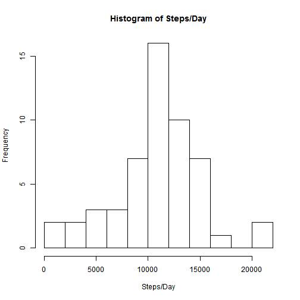
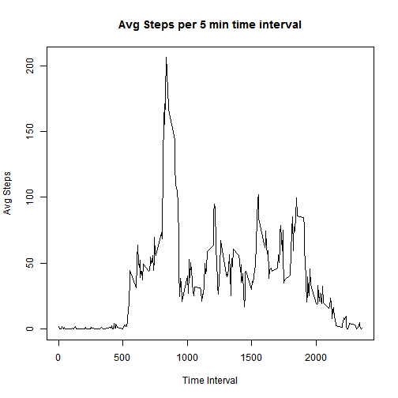
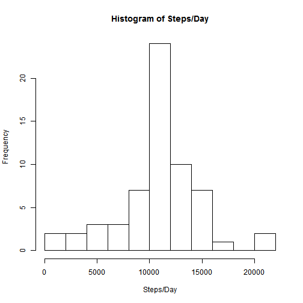
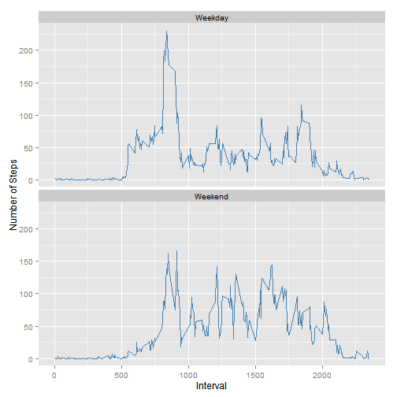

Loading and preprocessing the data
=================================


```r
library(ggplot2) #we use this a lot later
setwd("C:/Users/zachary/Documents/Coursera")
dat <- read.csv("./activity.csv")
```

What is mean total number of steps taken per day?
=================================================
1. Graph it as a histogram  
2. Calculate mean and median  

```r
data1 <- aggregate(.~date,dat=dat[,c(1,2)],FUN=sum)
hist(data1$steps,breaks=11,xlab="Steps/Day",main="Histogram of Steps/Day")
```

 

```r
mean(data1$steps)
```

```
## [1] 10766.19
```

```r
median(data1$steps)
```

```
## [1] 10765
```

What is the average daily activity pattern?
===========================================
1. Plot of the avg steps taken across all days for each time  
2. Calculation of the interval with the max avg steps  

```r
data2 <- aggregate(.~interval,dat=dat[,c(1,3)],FUN=mean)
with(data2,
     plot(interval,steps,type="l",xlab="Time Interval",ylab="Avg Steps",
          main="Avg Steps per 5 min time interval"))
```

 

```r
data2[which.max(data2[,2]),1]
```

```
## [1] 835
```

Imputing missing values
=======================
1. Calculate and report number of NA rows  

```r
sum(is.na(dat$steps))
```

```
## [1] 2304
```
2. Our strategy is to replace w/ the inveral mean we calculated earlier  
3. Create a new dataset with the missing data filled in
4. Histogram of steps taken each day, as well as mean and median per day

```r
for(i in 1:nrow(dat)){ #iterate through our original dataset
    if(is.na(dat[i,1])){ #check if there is an NA in the steps col
        # replace with the corresponding avg we calculated earlier
        #for that specific interval
        dat[i,1] <- data2[data2$interval==dat[i,3],]$steps
    }
}                                                          
data1 <- aggregate(.~date,dat=dat[,c(1,2)],FUN=sum)
hist(data1$steps,breaks=11,xlab="Steps/Day",main="Histogram of Steps/Day")
```

 

```r
mean(data1$steps)
```

```
## [1] 10766.19
```

```r
median(data1$steps)
```

```
## [1] 10766.19
```

Are there differences in activity patterns between weekdays and weekends?
========================================================================
1. Create a new  factor with two levels, weekend and weekday  
2. Create a panel plot with the avg steps for the two factors


```r
#add a column with the day of the week
weekday <- weekdays(as.POSIXct(dat$date),abbreviate=T)
weekday = replace(weekday,weekday %in% c("Sat","Sun"),"Weekend")
weekday = replace(weekday,weekday %in% 
                      c("Mon","Tue","Wed","Thu","Fri"),"Weekday")
weekday = factor(weekday)
dat = cbind(dat,weekday)
dat2 <- aggregate(.~interval+weekday,dat=dat[,c(1,3)],FUN=mean)
ggplot(dat2,aes(interval,steps))+
    geom_line(color="steelblue")+
    facet_wrap(~weekday,ncol=1,nrow=2)+
    labs(x="Interval",y="Number of Steps")
```

 


